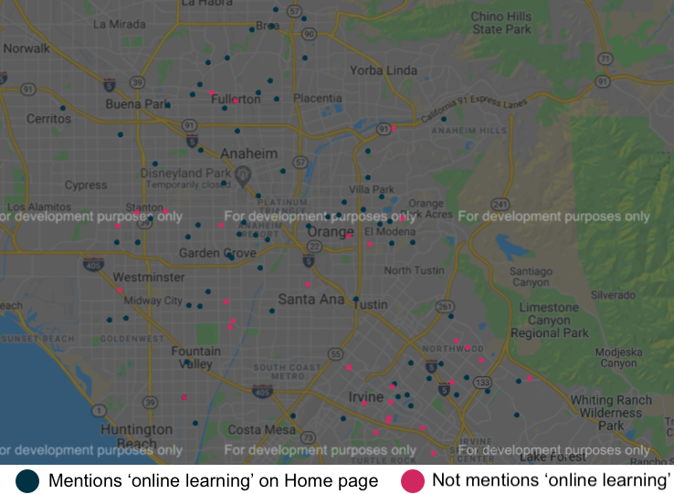

04.02.2020-04.03.2020

# How updated are school websites with online learning resources in response to COVID-19?

## Why?

On April 2, 2020, the California governor announced the [closing of all in-person instruction in K-12 schools](https://edsource.org/2020/california-k-12-schools-closed-due-to-the-coronavirus/624984).
Schools that I work with have responded in different ways: handing out paper packets, sending a list of online resources, or planning a bell schedule for online instruction.
I am curious to see the range in responses across different schools/geographic areas.

## Approaches

1. Scrape all California school homepages based on their school codes (package "bs4")
2. Look up if sites contain keywords related to online learning (e.g., 'online', 'virtual', 'connected', 'distal')
3. Visualize using geomapping. First obtain the latitude-longitude coordinates (package "geopy"), and then create the map (package "geomaps")

### This repository includes:
* The code base for scraping the sites
* The code base for generating a heatmap for the state
* The code base for generating geomap for Orange County
* An illustrative heatmap of school websites mentioning online learning keywords, based on the total sample
* An illustrative map of schools in Orange County

### Illustrative map

